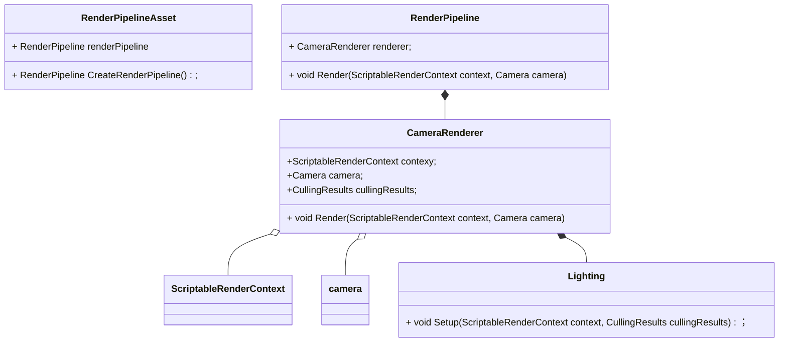
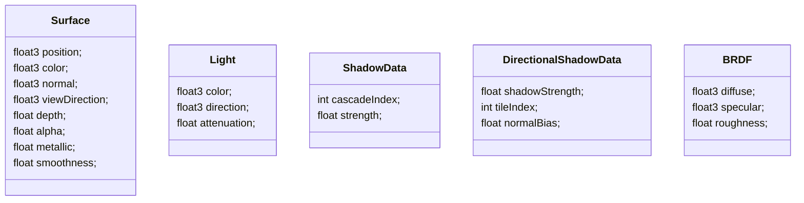

# ScripteRenderPipeline



流程

```c++
void CustomRenderPipeline::Render(ScriptableRenderContext context, Camera[] cameras)
{
    void CameraRenderer::Render(ScriptableRenderContext context, Camera camera, bool useDynamicBatching, bool useGPUInstancing) 
    {
    	Setup(); // 相机属性， clear,
        void Lighting::Setup(ScriptableRenderContext context, CullingResults cullingResults)
        {
            // 将Light数据传输到GPU
        }
        
        void DrawVisibleGeometry(bool useDynamicBatching, bool useGPUInstancing)
        {
            // 不透明物体渲染
            // skybox渲染
            // 半透明物体渲染
        }
        
        void Submit()
        {
            // 提交命令
        }
    }
}
```

shader



#### Surface

#### Light

attenuation：shadow

#### ShadowData

cascadeIndex，表示当前像素在第几个cascade层级上，根据片段离cascade球心的位置计算出
strength，最大距离时，阴影不应该立即消失，做过渡用的

#### DirectionalShadowData

shadowStrength, 有light.shadowStrength和ShadowData.strength相乘得来
tileIndex，在阴影贴图的第几个tile上，与cascadeIndex配合找到合适的Matrix
normalBias， light的normalBias，用来减少self shadowing

关于shadow的几个uniform变量

_ShadowDistanceFade

用途，在最大距离附近Fade阴影

公式： $$\frac{1 - d/m}{f}$$

d为fragment的深度，m为最大阴影深度，f为0.1-0.3

```c#
_ShadowDistanceFade = new Vector4( 1.0f / shadowSetting.maxDistance,
                                  1.0f / shadowSetting.distanceFade,
					            1f / (1f - f * f))
```

_CascadeData

Fading Cascades

_DirectionalLightShadowData

```c#
_DirectionalLightShadowData = new Vector3(light.shadowStrength, shadowSetting.directional.cascadeCount * ShadowedDirectionalLightCount++, light.shadowNormalBias) ;
```

流程

```c#
float4 LitPassFragment(Varings input)
{
    // 构造Surface
    
    // 根据Surface计算BRDF
    
    // 计算光照
    float3 GetLighting(Surface surface, BRDF brdf)
    {
        // 对每个方向光
        {
        	//颜色
            //方向
            //阴影信息
            {
                // 计算Matrix在数组的位置
                // 根据frament的深度计算fade参数
                
                // 在normal方向上对位置进行偏移，以避免self shadowing
                // 对偏移后的位置做转换，在shadowmap上进行采样
                // 采样值根据strength参数从1到0做插值得到阴影值
            }
            
            // Li = dot(normal, light.direction) * light.shadowAttenuation * light.color
            
            // Lo = Li * brdf
        }
        
        // 叠加每个方向光的值
    }
}
```

