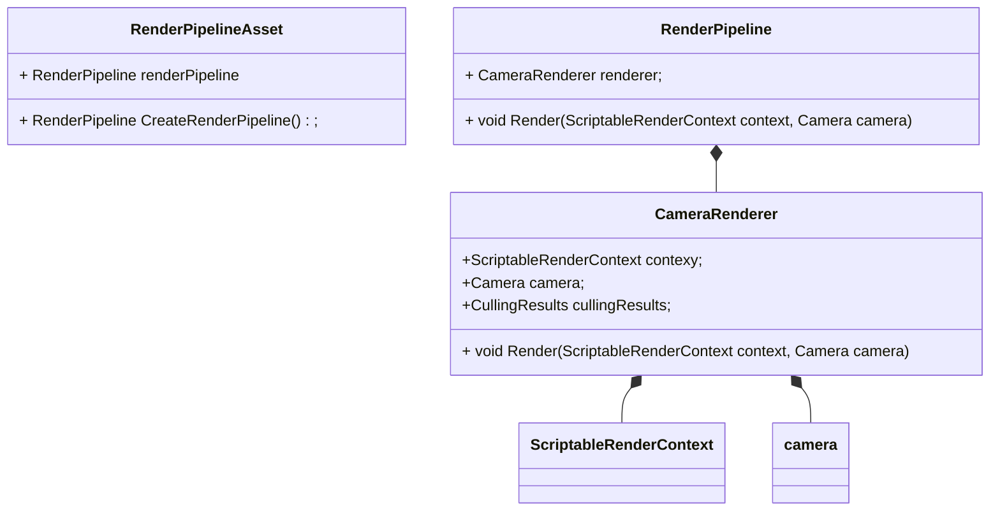

# ScripteRenderPipeline

```mermaid
classDiagram
class RenderPipelineAsset{
	+ RenderPipeline renderPipeline
	+ RenderPipeline CreateRenderPipeline();
}

class RenderPipeline{
	+ CameraRenderer renderer;
	+ void Render (ScriptableRenderContext context, Camera camera)
}

class CameraRenderer{
	+ScriptableRenderContext contexy;
	+Camera camera;
    +CullingResults cullingResults;
    
    + void Render (ScriptableRenderContext context, Camera camera)
}

RenderPipeline *-- CameraRenderer
CameraRenderer *-- ScriptableRenderContext
CameraRenderer *-- camera
```

