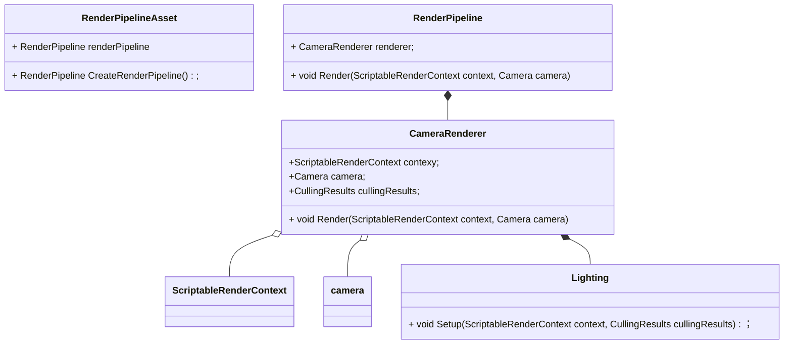

# ScripteRenderPipeline



流程

```c++
void CustomRenderPipeline::Render(ScriptableRenderContext context, Camera[] cameras)
{
    void CameraRenderer::Render(ScriptableRenderContext context, Camera camera, bool useDynamicBatching, bool useGPUInstancing) 
    {
    	Setup(); // 相机属性， clear,
        void Lighting::Setup(ScriptableRenderContext context, CullingResults cullingResults)
        {
            // 将Light数据传输到GPU
        }
        
        void DrawVisibleGeometry(bool useDynamicBatching, bool useGPUInstancing)
        {
            // 不透明物体渲染
            // skybox渲染
            // 半透明物体渲染
        }
        
        void Submit()
        {
            // 提交命令
        }
    }
}
```

shader
