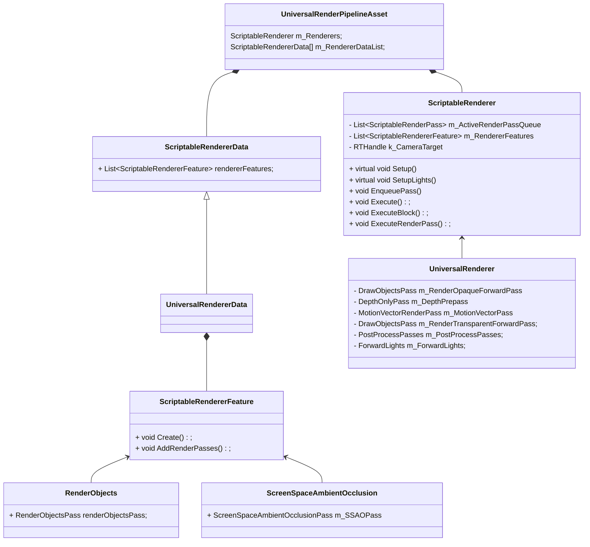
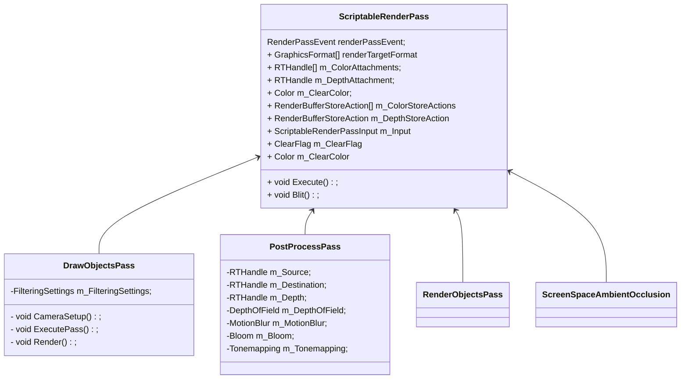
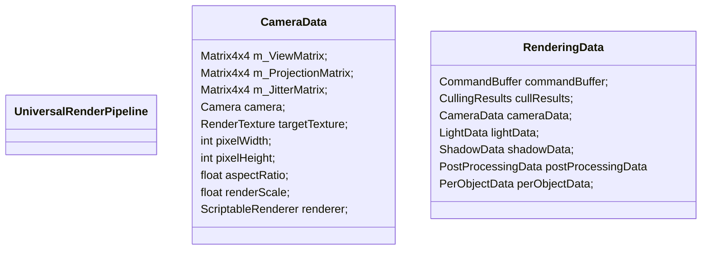

# ScripteRenderPipeline

#### 类图








#### 流程

创建

```c#
UniversalRenderPipelineAsset.CreatePipeline()
{
    var pipeline = new UniversalRenderPipeline(this);
    {
         SetSupportedRenderingFeatures(pipelineAsset);
        Lightmapping.SetDelegate(lightsDelegate);
        
        s_RenderGraph = new RenderGraph("URPRenderGraph");
        useRenderGraph = false; 
    }
    
    CreateRenderers();
    {
        m_Renderers[i] = m_RendererDataList[i].InternalCreateRenderer();
        {
            new UniversalRenderer(this);
            {
                ScriptableRenderer(ScriptableRendererData data);
                {
                    feature.Create();
                	m_RendererFeatures.Add(feature);          
                }
                m_ForwardLights = new ForwardLights(forwardInitParams);
                
                m_MainLightShadowCasterPass = new MainLightShadowCasterPass(RenderPassEvent.BeforeRenderingShadows);
                m_AdditionalLightsShadowCasterPass = new AdditionalLightsShadowCasterPass(RenderPassEvent.BeforeRenderingShadows);
                
                m_DepthPrepass = new DepthOnlyPass(BeforeRenderingPrePasses, RenderQueueRange.opaque, data.opaqueLayerMask);
                m_DepthNormalPrepass = new DepthNormalOnlyPass(BeforeRenderingPrePasses, RenderQueueRange.opaque, data.opaqueLayerMask);
                m_MotionVectorPass = new MotionVectorRenderPass(m_CameraMotionVecMaterial, m_ObjectMotionVecMaterial);
                
                //RenderingMode.Deferred处理
               
                m_PostProcessPasses = new PostProcessPasses(data.postProcessData, ref postProcessParams);     
                m_FinalBlitPass = new FinalBlitPass(AfterRendering + k_FinalBlitPassQueueOffset, m_BlitMaterial, m_BlitHDRMaterial);

            }
        }
    }
}

```

渲染

```c#
UniversalRenderPipeline.Render(ScriptableRenderContext renderContext, List<Camera> cameras)
{
    SetHDRState(cameras);
    
    RenderCameraStack(renderContext, camera);
    {
        InitializeCameraData();
        {
            cameraData.targetTexture = baseCamera.targetTexture;
            
            cameraData.isDitheringEnabled = baseAdditionalCameraData.dithering;
            cameraData.antialiasing = baseAdditionalCameraData.antialiasing;
            cameraData.antialiasingQuality = baseAdditionalCameraData.antialiasingQuality; 
            
            cameraData.allowHDROutput = baseAdditionalCameraData.allowHDROutput;
            
            cameraData.isHdrEnabled = baseCamera.allowHDR && settings.supportsHDR;
            cameraData.pixelRect = baseCamera.pixelRect;
            cameraData.pixelWidth = baseCamera.pixelWidth;
            cameraData.pixelHeight = baseCamera.pixelHeight;  
            cameraData.aspectRatio = (float)cameraData.pixelWidth / (float)cameraData.pixelHeight;
            cameraData.renderScale = disableRenderScale ? 1.0f : settings.renderScale;
        }
        
        void RenderSingleCamera(ScriptableRenderContext context, ref CameraData cameraData, bool anyPostProcessingEnabled)
        {
            renderer.OnPreCullRenderPasses(in cameraData);
            renderer.SetupCullingParameters(ref cullingParameters, ref cameraData);      
            
            SetupPerCameraShaderConstants();
            
            // vp
            motionVectorsPersistentData.Update(ref cameraData);
            
            // Update TAA persistent data
            UpdateTemporalAATargets(ref cameraData);
            
            var cullResults = context.Cull(ref cullingParameters);
            
            InitializeRenderingData(asset, ref cameraData, ref cullResults, anyPostProcessingEnabled, cmd, out var renderingData);
            {
                InitializeLightData();
                InitializeShadowData();
                InitializePostProcessingData();
            }
            
            void renderer.AddRenderPasses(ref RenderingData renderingData)
            {
                
            }
            
            renderer.Setup(context, ref renderingData);
            {
                m_ForwardLights.PreSetup(ref renderingData);
                
                EnqueuePass();
            }
            
            renderer.Execute(context, ref renderingData);
            {
                SetupLights();
                
                void ExecuteBlock(int blockIndex, in RenderBlocks renderBlocks,
                    ScriptableRenderContext context, ref RenderingData renderingData, bool submit = false)
                {
                    void ExecuteRenderPass(ScriptableRenderContext context, ScriptableRenderPass renderPass,
                                           ref RenderingData renderingData)
                    {
                        SetRenderPassAttachments();
                        void Execute(ScriptableRenderContext context, ref RenderingData renderingData);
                    }
                }
            }
            
            context.Submit();
        }
    }
}
```

#### UniversalRenderPipeline

```c#
public sealed partial class UniversalRenderPipeline : RenderPipeline
{
    protected override void Render(ScriptableRenderContext renderContext, List<Camera> cameras)
    {
        SetHDRState(cameras);
        BeginContextRendering(renderContext, cameras);
        
        SetupPerFrameShaderConstants();
        
        SortCameras(cameras);
        
        RenderCameraStack(renderContext, camera);
        
        EndContextRendering(renderContext, cameras);
    }
    
    static void RenderCameraStack(ScriptableRenderContext context, Camera baseCamera)
    {
        BeginCameraRendering(context, baseCamera);
        UpdateVolumeFramework(baseCamera, baseCameraAdditionalData);
        InitializeCameraData(baseCamera, baseCameraAdditionalData, !isStackedRendering, out var baseCameraData);
        InitializeAdditionalCameraData(baseCamera, baseCameraAdditionalData, !isStackedRendering, ref baseCameraData);
        RenderSingleCamera(context, ref baseCameraData, anyPostProcessingEnabled);
        EndCameraRendering(context, baseCamera);
    }
    
    static void RenderSingleCamera(ScriptableRenderContext context, ref CameraData cameraData, bool anyPostProcessingEnabled)
    {
        TryGetCullingParameters(cameraData, out var cullingParameters);
        
        renderer.Clear(cameraData.renderType);
        
        renderer.OnPreCullRenderPasses(in cameraData);
        renderer.SetupCullingParameters(ref cullingParameters, ref cameraData); 
        
        SetupPerCameraShaderConstants(cmd);
        
        additionalCameraData.motionVectorsPersistentData.Update(ref cameraData);
        
        UpdateTemporalAATargets(ref cameraData);
        
        var cullResults = context.Cull(ref cullingParameters);
        InitializeRenderingData(asset, ref cameraData, ref cullResults, anyPostProcessingEnabled, cmd, out var renderingData);
        
        renderer.AddRenderPasses(ref renderingData);
        
        renderer.Setup(context, ref renderingData);
        
        renderer.Execute(context, ref renderingData);
        
        context.ExecuteCommandBuffer(cmd);
            
        context.Submit(); 
    }
}
```

#### UniversalRenderer

```c#
public sealed partial class UniversalRenderer : ScriptableRenderer
{
    public UniversalRenderer(UniversalRendererData data) : base(data)
    {
        m_ForwardLights = new ForwardLights(forwardInitParams);
        
        m_MainLightShadowCasterPass = new MainLightShadowCasterPass(RenderPassEvent.BeforeRenderingShadows);
        m_AdditionalLightsShadowCasterPass = new AdditionalLightsShadowCasterPass(RenderPassEvent.BeforeRenderingShadows);      
        
        m_DepthPrepass = new DepthOnlyPass(RenderPassEvent.BeforeRenderingPrePasses, RenderQueueRange.opaque, data.opaqueLayerMask);
        m_DepthNormalPrepass = new DepthNormalOnlyPass(RenderPassEvent.BeforeRenderingPrePasses, RenderQueueRange.opaque, data.opaqueLayerMask);
        m_MotionVectorPass = new MotionVectorRenderPass(m_CameraMotionVecMaterial, m_ObjectMotionVecMaterial);
        
        m_RenderOpaqueForwardPass = new DrawObjectsPass(DrawOpaqueObjects, true, BeforeRenderingOpaques, RenderQueueRange.opaque, opaqueLayerMask, m_DefaultStencilState, stencilData.stencilReference);
        m_RenderOpaqueForwardWithRenderingLayersPass = new DrawObjectsWithRenderingLayersPass();
        
        m_DrawSkyboxPass = new DrawSkyboxPass(RenderPassEvent.BeforeRenderingSkybox);
        m_CopyColorPass = new CopyColorPass(RenderPassEvent.AfterRenderingSkybox, m_SamplingMaterial, m_BlitMaterial);    
        
        m_PostProcessPasses = new PostProcessPasses(data.postProcessData, ref postProcessParams);
    }
    
    public override void Setup(ScriptableRenderContext context, ref RenderingData renderingData)
    {
        m_ForwardLights.PreSetup(ref renderingData);

        EnqueuePass(m_MainLightShadowCasterPass);
        EnqueuePass(m_AdditionalLightsShadowCasterPass);

        EnqueuePass(renderOpaqueForwardPass);
        EnqueuePass(m_DrawSkyboxPass);
        EnqueuePass(m_RenderTransparentForwardPass);

        EnqueuePass(postProcessPass);

        EnqueuePass(m_FinalBlitPass);
    }
    
    void InternalStartRendering(ScriptableRenderContext context, ref RenderingData renderingData)
    {
        m_ActiveRenderPassQueue[i].OnCameraSetup(renderingData.commandBuffer, ref renderingData);
    }
    
    public void Execute(ScriptableRenderContext context, ref RenderingData renderingData)
    {
        SetupRenderPasses(in renderingData);
        
        InternalStartRendering(context, ref renderingData);
        
        SortStable(m_ActiveRenderPassQueue);
        
        pass.Configure(cmd, cameraData.cameraTargetDescriptor);
        
        SetupLights(context, ref renderingData);
        
        ExecuteBlock(RenderPassBlock.BeforeRendering, in renderBlocks, context, ref renderingData);
        
        ExecuteBlock(RenderPassBlock.MainRenderingOpaque, in renderBlocks, context, ref renderingData);
        
        ExecuteBlock(RenderPassBlock.MainRenderingTransparent, in renderBlocks, context, ref renderingData);
        
        ExecuteBlock(RenderPassBlock.AfterRendering, in renderBlocks, context, ref renderingData);
        
        InternalFinishRendering(context, cameraData.resolveFinalTarget, renderingData);
    }
    
    void ExecuteRenderPass(ScriptableRenderContext context, ScriptableRenderPass renderPass,
            ref RenderingData renderingData) 
    {
        SetRenderPassAttachments(cmd, renderPass, ref cameraData);
        renderPass.Execute(context, ref renderingData);
    }
}
```

#### DrawObjectsPass

```c#
public class ScriptableRenderPass
{
    public ScriptableRenderPass(string profilerTag, ShaderTagId[] shaderTagIds, bool opaque, RenderPassEvent evt, RenderQueueRange renderQueueRange, LayerMask layerMask, StencilState stencilState, int stencilReference)
    {
        m_FilteringSettings = new FilteringSettings(renderQueueRange, layerMask);
    }
    
    private static void ExecutePass(ScriptableRenderContext context, PassData data, ref RenderingData renderingData, bool yFlip)
    {   
        context.DrawRenderers(renderingData.cullResults, ref drawSettings, ref filterSettings, ref data.m_RenderStateBlock);
    }
    
    public override void OnCameraSetup(CommandBuffer cmd, ref RenderingData renderingData)
    {
        
    }
}
```

