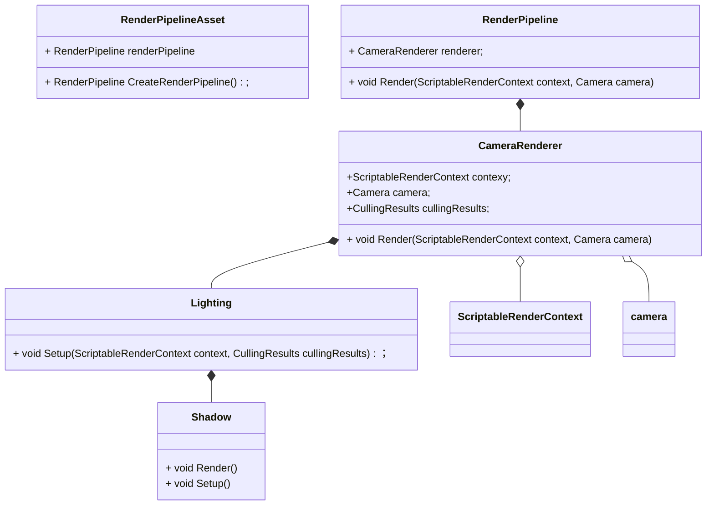
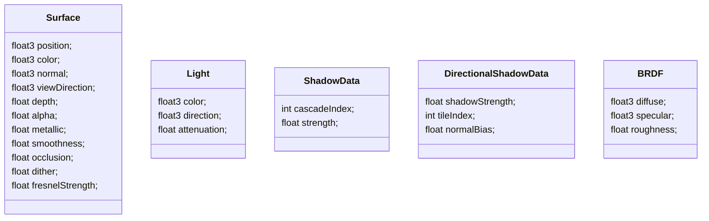
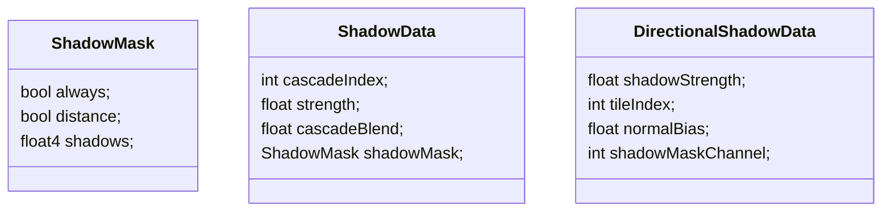

# ScripteRenderPipeline



流程

```c++
void CustomRenderPipeline::Render(ScriptableRenderContext context, Camera[] cameras)
{
    void CameraRenderer::Render(ScriptableRenderContext context, Camera camera, bool useDynamicBatching, bool useGPUInstancing) 
    {
    	Setup(); // 相机属性， clear,
        void Lighting::Setup(ScriptableRenderContext context, CullingResults cullingResults)
        {
            shadow.Setup(context, cullingResults, shadowSetting);
            // 将Light数据传输到GPU
		   shadow.Render();
        }
        
        void DrawVisibleGeometry(bool useDynamicBatching, bool useGPUInstancing)
        {
            // 不透明物体渲染
            // skybox渲染
            // 半透明物体渲染
        }
        
        void Submit()
        {
            // 提交命令
        }
    }
}
```

shader



#### Surface

#### Light

attenuation：shadow

#### ShadowData

cascadeIndex，表示当前像素在第几个cascade层级上，根据片段离cascade球心的位置计算出
strength，最大距离时，阴影不应该立即消失，做过渡用的

#### DirectionalShadowData

shadowStrength, 有light.shadowStrength和ShadowData.strength相乘得来
tileIndex，在阴影贴图的第几个tile上，与cascadeIndex配合找到合适的Matrix
normalBias， light的normalBias，用来减少self shadowing

关于shadow的几个uniform变量

_ShadowDistanceFade

用途，在最大距离附近Fade阴影

公式： $$\frac{1 - d/m}{f}$$

d为fragment的深度，m为最大阴影深度，f为0.1-0.3

```c#
_ShadowDistanceFade = new Vector4( 1.0f / shadowSetting.maxDistance,
                                  1.0f / shadowSetting.distanceFade,
					            1f / (1f - f * f))
```

_CascadeData

Fading Cascades

_DirectionalLightShadowData

```c#
_DirectionalLightShadowData = new Vector3(light.shadowStrength, shadowSetting.directional.cascadeCount * ShadowedDirectionalLightCount++, light.shadowNormalBias) ;
```

流程

```c#
float4 LitPassFragment(Varings input)
{
    // 构造Surface
    
    // 根据Surface计算BRDF
    
    // 计算光照
    float3 GetLighting(Surface surface, BRDF brdf)
    {
        // 对每个方向光
        {
        	//颜色
            //方向
            //阴影信息
            {
                // 计算Matrix在数组的位置
                // 根据frament的深度计算fade参数
                
                // 在normal方向上对位置进行偏移，以避免self shadowing
                // 对偏移后的位置做转换，在shadowmap上进行采样
                // 采样值根据strength参数从1到0做插值得到阴影值
            }
            
            // Li = dot(normal, light.direction) * light.shadowAttenuation * light.color
            
            // Lo = Li * brdf
        }
        
        // 叠加每个方向光的值
    }
}
```

#### 直接光照计算

##### BRDF计算公式

- 漫反射

实际上，一些光线也会反射在介电表面上，这使它们具有高光。非金属的反射率各不相同，但平均值约为0.04。让我们将这个值定义为最小反射率，并添加一个OneMinusReflectivity函数，将范围从0-1调整为0-0.96。
$$
oneMinusReflectivity = (1 - MINREFLECTIVITY) - metallic * (1 - MINREFLECTIVITY)
$$

$$
brdf.diffuse = surface.color * oneMinusReflectivity
$$

- Specular
  $$
  F0 = lerp(MIN_REFLECTIVITY, surface.color, metallic)
  $$

  $$
  Roughness = (1 - smoothness)^2
  $$

$$
DirectBRDF = brdf.specular + brdf.diffuse
$$


##### 光计算公式

$$
Li = {surface.normal} \cdot light.direction * shadow * light.color  
$$

##### 直接光照公式

$$
 Lo  = Li * DirectBRDF
$$

#### 环境光计算公式

##### BRDF计算公式

- diffuse与直接光照一样

- Specular
  $$
  brdf.fresnel = saturate(surface.smoothness + 1.0 - oneMinusReflectivity)
  $$

  $$
  fresnelStrength = surface.fresnelStrength * (1 - normal \cdot viewDirection)^4
  $$

  $$
  specular = lerp(brdf.specular, brdf.fresnel, fresnelStrength) /(roughness^2 + 1.0)
  $$

##### 光照

- diffuse

  静态物体直接采样LightMap，动态物体采样LightProbe，使用球谐光照计算

- specular

  使用Reflection Probe

##### 间接光照

$$
Lo = gi.diffuse * brdf.diffuse + gi.specular * specular
$$

------

#### Shader中的Uniform变量结构

- UnityPerMaterial(LitInput)

  ```
  float4 _BaseMap_ST
  float4 _BaseColor
  float4 _EmissionColor
  float _Cutoff
  float _Metallic
  float _Smoothness
  float _Fresnel
  ```

- UnityPerDraw(UnityInput)

  ```
  	float4x4 unity_ObjectToWorld;
  	float4x4 unity_WorldToObject;
  	float4 unity_LODFade;
  	real4 unity_WorldTransformParams;
  
  	float4 unity_LightmapST;
  	float4 unity_DynamicLightmapST;
  
  	float4 unity_SHAr;
  	float4 unity_SHAg;
  	float4 unity_SHAb;
  	float4 unity_SHBr;
  	float4 unity_SHBg;
  	float4 unity_SHBb;
  	float4 unity_SHC;
  
  	float4 unity_ProbeVolumeParams;
  	float4x4 unity_ProbeVolumeWorldToObject;
  	float4 unity_ProbeVolumeSizeInv;
  	float4 unity_ProbeVolumeMin;
  
  	float4 unity_SpecCube0_HDR;
  ```

- _CustomShadows

  ```
  	int _CascadeCount;
  	float4 _ShadowDistanceFade;
  	float4 _ShadowAtlasSize;
  	float4 _CullingSpheres[Max_Cascades_Count];
  	float4 _CascadeData[Max_Cascades_Count];
  	float4x4 _DirectionalShadowMatrices[Max_Directional_Light_Count * Max_Cascades_Count];
  ```


Shadow**相关**



#### 阴影的计算

**ShadowData**

最大距离上需要fade，strength的计算方式$$ (1 - d/m) / f$$，d是离相机的距离，m是最大距离， f是0.1， 0.2， 0.5。如果超过最大距离，strength为0。

级联之间需要Fade，cascadeBlend的计算方式是$$(1 - d^2 / r^2) / (1 - (1 -f)^2)$$

shadowmask的计算

always表示是否一直使用bakeShadowMap

distance表示在最大阴影距离内使用实时阴影，最大距离外使用bakeShadowMap

**DirectionalShadowData**

shadowStrength是light.shadowStrength

##### 混合烘焙阴影和实时阴影的算法

always为真时

```
		shadow = lerp(1.0, shadow, global.strength);
		shadow = min(baked, shadow);
		shadow = lerp(1.0, shadow, strength);
```

distance为真时

```
		shadow = lerp(baked, shadow, global.strength);
		shadow =  lerp(1.0, shadow, strength);
```

